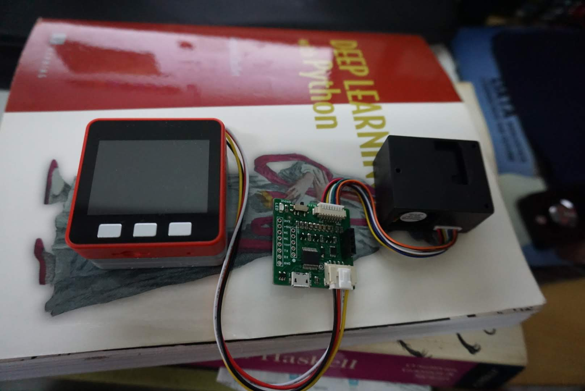
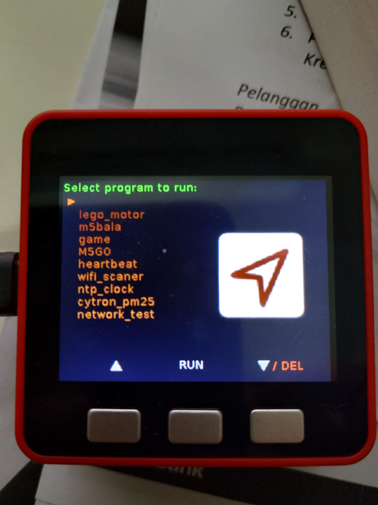

# M5Stack + Honeywell PM2.5

The M5Stack is a microcontroller based on ESP32, by default have micropython on board and it is arduino compatible. The code to read from the HPM Sensor is written with micropython. 

This is no mean the cheapest to do this, but this is easiest to bring it up. It don't require extra soldering, and lesser messy wires, support python so the code is easier to change.

## Bill of Material

* [M5Stack Fire](https://www.aliexpress.com/store/product/M5Stack-NEW-PSRAM-2-0-FIRE-IoT-Kit-Dual-Core-ESP32-16M-FLash-4M-PSRAM-Development/3226069_32847906756.html?spm=2114.12010615.8148356.5.10b2562364axVV) - RM207.29(USD51) the price include delivery
* [Honeywell HPM Sensor](https://www.cytron.io/p-honeywell-pm2.5-particle-sensor-module?search=pm2.5&description=1&src=search) - RM209.00(USD51.42)

## Source code 

Source code is written with micropython, can be found in src directory

## Usage and setup. 

Note that favoriot api service, you will need to register this first. Still trying to figure out how to have people contribute data to a central repository.

* Change the settings in `hazeconf.json`
* copy `hazeconf.json` to `/flash`
`ampy --port /dev/ttyUSB0 put hazeconf.json /flash/hazeconf.json`
* copy `cytron_pm25.py` to `/flash/apps/`
`ampy --port /dev/ttyUSB0 put cytron_pm25.py /flash/apps/cytron_pm25.py`
* You should be able to see `cytron_pm25` under apps

Note that I use `ampy` here, but it stopped being updated. I suggest rshell for micropython which I am still getting used to. 

## Random note

* It is possible to change the M5Stack type with only a [core](https://docs.m5stack.com/#/en/core/basic) and [m5go base](https://docs.m5stack.com/#/en/base/m5go_bottom). But didn't try, it should work though. 
  * We can' use the core unit directly because the Particulate sensor output in UART, the core unit don't have it. Only the m5go base have it. 
* It is also possible to adapt this code to ESP32 and ESP8266
